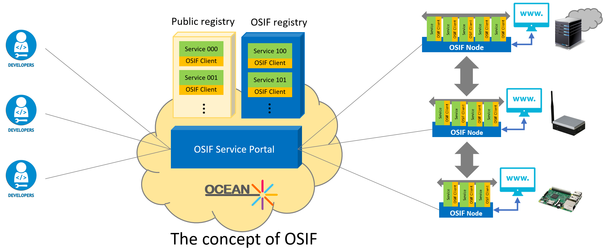
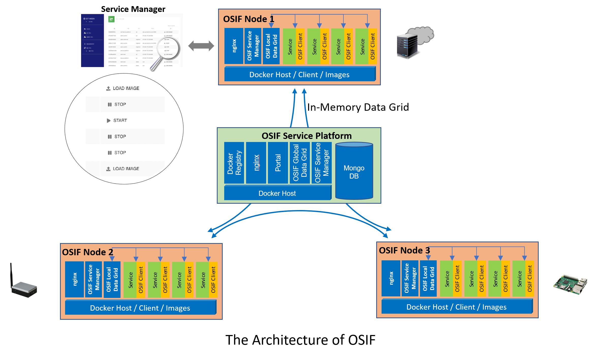

# OSIF (Open Service Integration Framework) #

### OSIF is a software integration framework for OCEAN. ###

* An open source software platform
* Supports the microservices architecture based on virtualization technology (Docker).
* Provides OSIF data grid among services using Hazelcast's IMDG (In-Memory Data Grid).
* Manages the lifecycle of services: download, monitor, run, stop and delete by Web UI.

### Concept of OSIF ###

### Architecture of OSIF ###

### Related repositories ###

* [link to Google!](http://google.com)
* [link to Google!](http://google.com)
